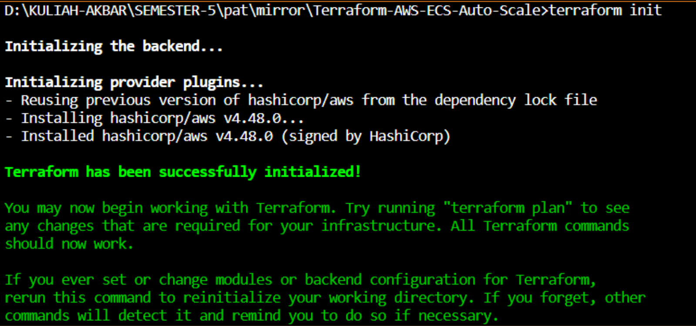
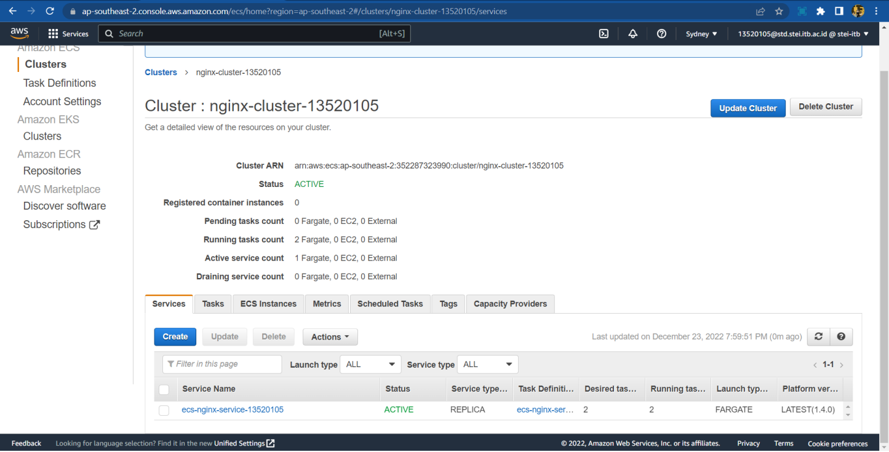
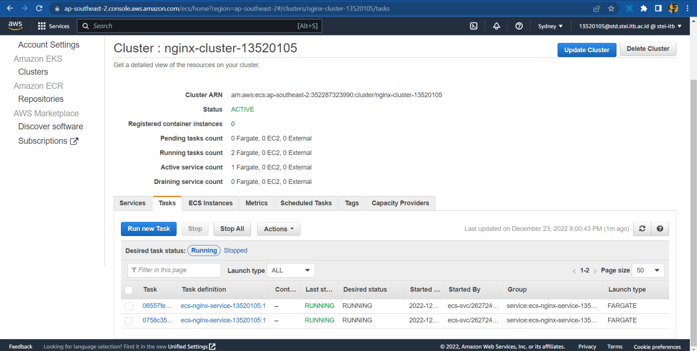
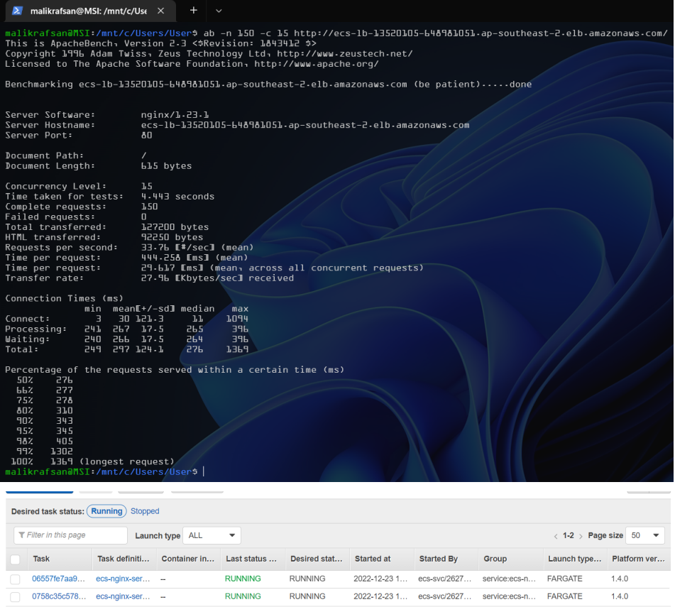
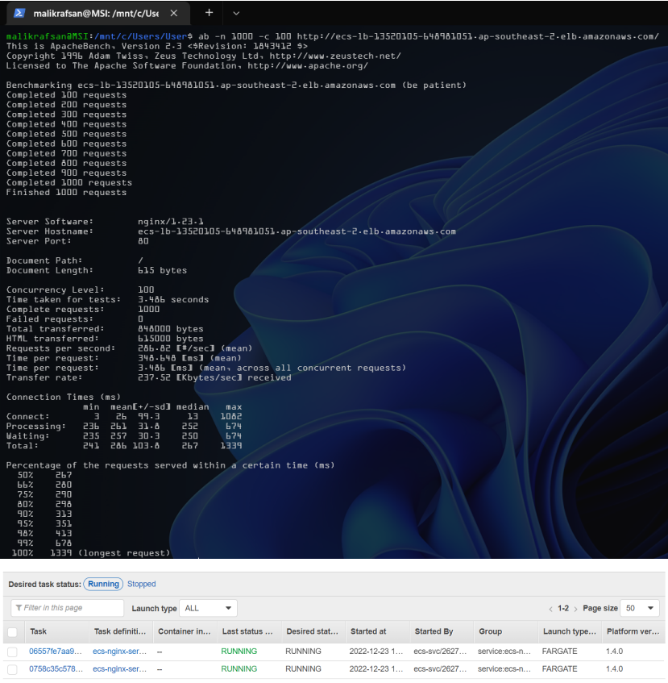
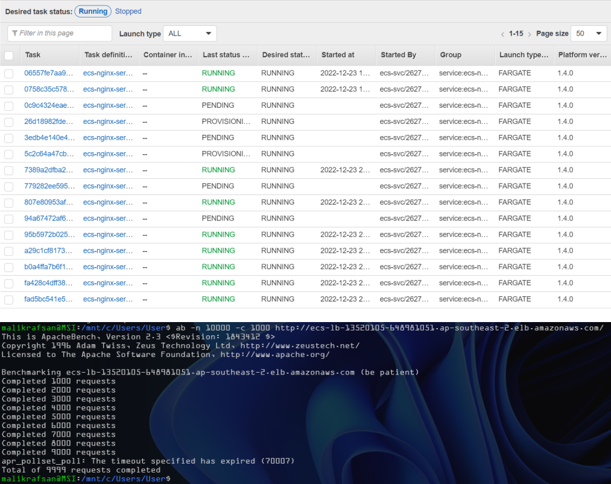

# AWS Nginx ECS Cluster with Load Balancer and Fargate Launch Type and Target Tracking Autoscaling

## Project Description
This project is developed using Terraform, infrastructure as code tool for safely and predictably provisioning and managing infrastructure in any cloud. This project create an Nginx Cluster behind a load balancer application in AWS ECS Cluster. This creation uses Fargate Launch Type pada Terraform. This projects also implement auto-scaling to maintain around 10 request per target/task (automatically increase and decrease deployments)

## What I Learned
From this project, I learned a lot about configuring infrastructure in general, especially using Terraform and AWS. I also learned a lot about networking in a cluster infrastructure where public subnets and private subnets are used, along with how to use routing via a routing table. I also learned about hands on load balancers and application auto scaling, which are very useful in distributed applications. These things are quite new things for me and I feel very happy to have these new experiences

## Project Report
We can access the project report, which contains detailed step by step implementation and evaluation-testing, [here](docs/13520105_Tugas%20Tambahan_IF4031.pdf)

## How to Run
- Clone this repository
- Make sure you have terraform installed (You can refer to this [link](https://developer.hashicorp.com/terraform/tutorials/aws-get-started/install-cli)). This repository is tested for terraform version 1.3.5
- Make sure you have AWS cli installed on your machine
- Copy `keys.tfvars.example` to `keys.tfvars` and add your AWS credential
- Run this command to initialize terraform project
  ```
  terraform init
  ```
- Run this command to see plan that will configured when you apply the configuration
  ```
  ./scripts/plan.sh
  ``` 
- Run this command to apply configuration. 
  ```
  ./scripts/apply
  ```
- You can see load_balancer url in terminal, under output.

## How To Delete Resource (after resources made)
- Run this command
  ```
  terraform destroy -var-file="keys.tfvars"
  ```

## Testing and Screenshots
### Initialization
#### Terraform Init


### Result
#### Service Dashboard AWS


#### Task Dashboard AWS


#### Auto-Scaling
In this project, auto scaling is implemented to maintain 10 requests per target, in this case tasks, with a minimum of 2 instances and a maximum of 15 instances. To simulate many requests concurrently, Apache Bench (AB) software is used.

1. 150 Request with 15 Concurent Request


2. 1,000 Request with 100 Concurent Request


3. 10,000 Request with 1000 Concurent Request


## References
- https://www.architect.io/blog/2021-03-30/create-and-manage-an-aws-ecs-cluster-with-terraform/
- https://developer.hashicorp.com/terraform/tutorials/aws-get-started/aws-build
- https://registry.terraform.io/providers/hashicorp/aws/latest/docs/resources/security_group
- https://registry.terraform.io/providers/hashicorp/aws/latest/docs/resources/lb
- https://registry.terraform.io/providers/hashicorp/aws/latest/docs/resources/lb_target_group
- https://registry.terraform.io/providers/hashicorp/aws/latest/docs/resources/lb_listener
- https://registry.terraform.io/providers/hashicorp/aws/latest/docs/resources/ecs_task_definition
- https://registry.terraform.io/providers/hashicorp/aws/latest/docs/resources/ecs_cluster
- https://registry.terraform.io/providers/hashicorp/aws/latest/docs/resources/ecs_service
- https://developer.hashicorp.com/terraform/language/values/outputs


## Author
Malik Akbar Hashemi Rafsanjani | 13520105
